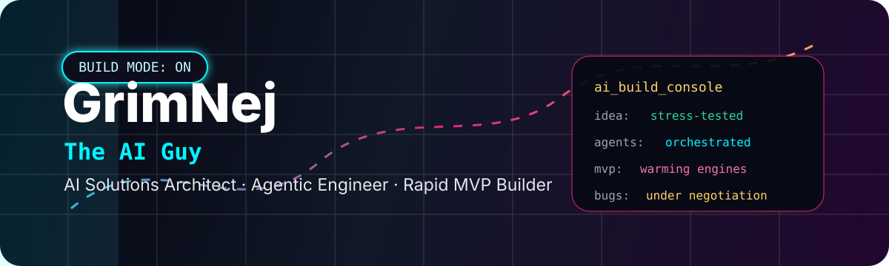
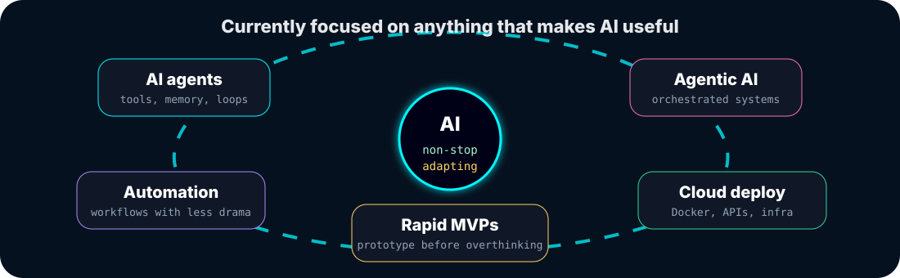

  

  
  
  
  
  
  

<h1 align="center">Ginej Neupane / GrimNej</h1>
<h3 align="center">The AI Guy | AI Solutions Architect | Agentic Engineer | GenAI Engineer | Rapid MVP Builder</h3>

  

---

## Hi

I am Ginej Neupane, better known in the dev community as **GrimNej**.

I build practical AI systems: agentic workflows, automation tools, RAG pipelines, model-powered products, internal copilots, and fast MVPs for teams that need to move from idea to execution without getting trapped in endless planning.

My strongest suit is **rapid execution**. If an idea needs a technical verdict, I can break it down, choose the right architecture, and ship a working foundation quickly. I am not married to one framework or stack; I use whatever gets the product built, tested, deployed, and ready for the next iteration.

  

  

## Current Focus

AI agents, agentic AI, automation tools, rapid MVP development, cloud deployment, and the constant **non-stop adapting** required to keep up with a field that reinvents itself every other coffee break.

## AI Engineering Stack

  

  
  
  
  
  
  
  
  
  
  
  
  
  
  
  
  
  
  
  
  
  
  
  

  
<b>Expanded toolbox</b>

   

  **Languages:** Python, TypeScript, JavaScript, Rust, Java, Lua, PHP, SQL, HTML, CSS  
  **AI systems:** OpenAI, OpenAI Agents SDK, Anthropic, Gemini, Google ADK, LangChain, LangGraph, LlamaIndex, CrewAI, AutoGen, Pydantic AI, DSPy, Mastra, Haystack, Semantic Kernel, Agno, MCP, RAG, embeddings, evals, tool calling, structured outputs  
  **Backend and apps:** FastAPI, Flask, Node.js, Next.js, React, REST APIs, WebSockets, background jobs  
  **Data and storage:** PostgreSQL, Supabase, Redis, MongoDB, Pinecone, Qdrant, Chroma, object storage  
  **Cloud and shipping:** Docker, Kubernetes, AWS, Google Cloud, Azure, CI/CD, Linux, GitHub Actions, observability  
  **ML and media:** PyTorch, TensorFlow, Pandas, NumPy, OpenCV, Hugging Face, local models, Ollama

## Operating Style

  

## What I Am Looking For

I am looking for AI startups, founders, and enterprise teams that need someone who can think architecturally and execute quickly. If you need an agentic system, automation layer, internal AI tool, or MVP that proves the idea is technically real, I am the person you call when the deadline has already started looking at you funny.

## Connect

  
  
  
  
  
  

